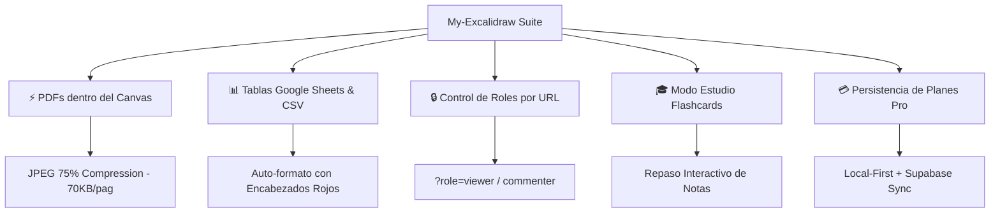
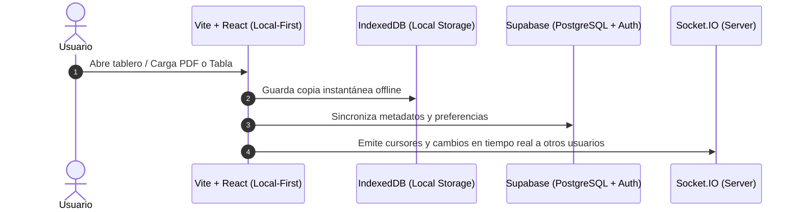

<div align="center">


# My-Excalidraw

**Plataforma de Pizarra Virtual, Colaboración en Tiempo Real, PDFs, Tablas de Google Sheets y Espacio de Estudio Infinito**

[](https://github.com/luisrodriguez-rgb)
[](https://my-excalidraw-nine.vercel.app)
[](https://reactjs.org/)
[](https://www.typescriptlang.org/)
[](https://supabase.com)

[🚀 Probar Aplicación en Vivo](https://my-excalidraw-nine.vercel.app) • [📊 Tabla Comparativa vs Excalidraw](#-tabla-comparativa-my-excalidraw-vs-excalidraw-original) • [📖 Arquitectura](#-arquitectura-del-sistema)

</div>

---

## 💡 Acerca del Proyecto

**My-Excalidraw** es una extensión avanzada y personalizada de Excalidraw diseñada para transformar una simple pizarra virtual en un **entorno de trabajo, presentación y estudio todo-en-uno**. Permite integrar documentos **PDF**, tablas nativas importadas desde **Google Sheets / Excel**, notas enriquecidas en **Markdown**, salas de colaboración multi-usuario, roles de lectura y un **Modo Estudio** interactivo con tarjetas de memoria.

---

## 📊 Tabla Comparativa: My-Excalidraw vs. Excalidraw Original

| Característica | Excalidraw Estándar | My-Excalidraw (Este Proyecto) |
| :--- | :---: | :---: |
| **Documentos PDF en Canvas** | ❌ No soportado | ⚡ **Renderizado nativo con compresión JPEG 75% (~70KB/pág)** |
| **Tablas de Google Sheets & CSV** | ❌ No soportado | 📊 **Conversión instantánea a tablas reticulares editables** |
| **Modo Estudio & Flashcards** | ❌ No soportado | 🎓 **Tarjetas de memorización activa con progreso** |
| **Control de Roles por URL** | ❌ No disponible | 🔒 **Modo Lector (`?role=viewer`) y Comentador (`?role=commenter`)** |
| **Dashboard y Workspaces** | ❌ Pizarra única volátil | 📂 **Gestión de carpetas, papelera de reciclaje y filtros** |
| **Persistencia de Datos** | ⚠️ Solo LocalStorage básico | 🔄 **Local-First (IndexedDB) + Nube (Supabase Cloud Sync)** |
| **Notas Enriquecidas** | ❌ Texto plano | 📝 **Panel lateral de especificaciones en Markdown** |
| **Comentarios Interactivos** | ❌ No disponible | 💬 **Hilos de comentarios anclados a figuras** |
| **Modo Presentación Cine** | ⚠️ Básico | 🎬 **Marcos estilo diapositiva + Exportación a PPTX** |
| **Navegación & Chat Colaborativo**| ❌ No disponible | 🗺️ **Minimapa 120 FPS + Chat lateral en tiempo real** |
| **Gestión de Cuota / Planes** | ❌ No disponible | 💳 **Persistencia de planes Pro/Empresarial (Free / Pro / Ent)** |

---

## ✨ Novedades y Capacidades Extendidas



### ⚡ 1. Importación Ultra-Rápida de PDF (Motor Local Sin Lag)
- Renderiza archivos PDF de múltiples páginas directamente sobre la pizarra.
- **Compresión Inteligente JPEG (75%)**: reduce el tamaño por página de ~800 KB a solo **~70 KB**, permitiendo hacer zoom, anotar y vincular diagramas sin sobrecargar el navegador.
- **Renderizado Blanco Sólido**: elimina transparencias o marcas en blanco al instante.

### 🔒 2. Control de Permisos de Roles por URL
- **Modo Lector**: `?role=viewer`
- **Modo Comentador**: `?role=commenter`
- Bloquea forzosamente la edición del canvas (`viewModeEnabled = true`) para usuarios invitados, protegiendo tus esquemas originales.

### 📊 3. Importador de Google Sheets & CSV
- Copia celdas de Excel o Google Sheets (`Cmd+C` / `Ctrl+C`) y genera tablas vectoriales formateadas en un clic (`Cmd+V` / `Ctrl+V`).
- Soporta presupuestos, inventarios y cronogramas de hasta 500 celdas por tabla.

### 🎓 4. Modo Estudio (Flashcards Interactivas)
- Convierte tus apuntes y diagramas en un sistema de memorización activa.
- Voltea tarjetas de repaso, mide tu porcentaje de dominio y marca temas para revisar luego.

### 📂 5. Dashboard, Carpetas y Workspaces
- Organiza tus proyectos en carpetas, aplica etiquetas de estado y recupera tableros desde la papelera de reciclaje.

### 💳 6. Gestión y Persistencia de Planes
- Guarda la suscripción del usuario (*Gratuito / Pro / Empresarial*) en `localStorage` y la sincroniza con la cuenta de Supabase.

---

## 📖 Arquitectura del Sistema



---

## 🛠️ Guía de Instalación Local

```bash
# 1. Clonar el repositorio
git clone https://github.com/luisrodriguez-rgb/My-Excalidraw.git

# 2. Entrar al directorio
cd My-Excalidraw/excalidraw

# 3. Dar permisos de ejecutable e instalar dependencias
yarn install

# 4. Iniciar el servidor de desarrollo local
npm run start
```

---

## 👨‍💻 Creador & Mantenimiento

Desarrollado y mantenido por **Luis Rodriguez** ([@luisrodriguez-rgb](https://github.com/luisrodriguez-rgb)).

<div align="center">
  <a href="https://github.com/luisrodriguez-rgb">
    
    <br/>
    <strong>Luis Rodriguez (luisrodriguez-rgb)</strong>
  </a>
</div>
