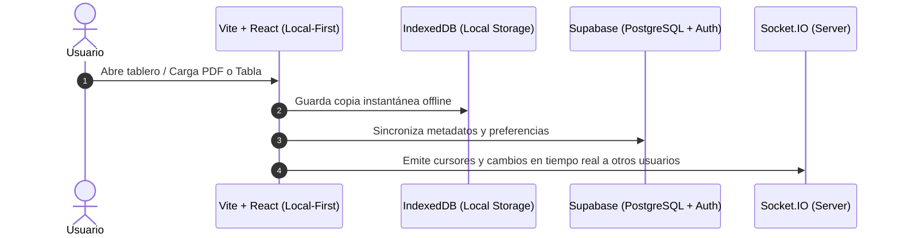

<div align="center">


# My-Excalidraw

**Workspace Visual para Estudiar, Colaborar, Documentar, Presentar y Construir con IA**

[](https://github.com/luisrodriguez-rgb)
[](https://my-excalidraw-nine.vercel.app)
[](https://reactjs.org/)
[](https://www.typescriptlang.org/)
[](https://supabase.com)

[🚀 Probar Aplicación en Vivo](https://my-excalidraw-nine.vercel.app) • [🚀 Visión](#-visión-del-proyecto) • [🎯 Casos de Uso](#-casos-de-uso-principales) • [🧠 Templates + AI](#-próxima-generación-templates--ai) • [📖 Arquitectura](#-arquitectura-del-sistema)

</div>

---

## 💡 Acerca del Proyecto

**My-Excalidraw** transforma la tradicional pizarra a mano alzada en un **Workspace Visual todo-en-uno**. Permite integrar documentos **PDF**, tablas nativas importadas desde **Google Sheets / Excel**, especificaciones enriquecidas en **Markdown**, salas de colaboración multi-usuario, roles de lectura y un **Modo Estudio** interactivo con tarjetas de memoria.

---

## 🚀 Visión del Proyecto

My-Excalidraw no busca ser únicamente una pizarra digital.

Nuestra visión es construir un **Workspace Visual** donde estudiantes, profesionales y equipos puedan:

- 🧠 **Pensar**: Bocetar e iterar libremente.
- 📌 **Planificar**: Organizar proyectos y sprints.
- 📚 **Aprender**: Estudiar PDFs y notas con memorización activa.
- 📝 **Documentar**: Vincular especificaciones y arquitecturas.
- 🎬 **Presentar**: Exponer ideas en modo diapositivas cine.
- 🤝 **Colaborar**: Trabajar en equipo en tiempo real.

todo desde un único espacio de trabajo.

La evolución del proyecto se basa en tres pilares principales:

- 📚 **Plantillas profesionales**: Estructuras predeterminadas para casos reales de universidad, ingeniería y producto.
- 🧠 **Motores visuales reutilizables**: Integración nativa de PDFs, tablas de datos y tarjetas de repaso.
- 🤖 **Skills de IA**: Capaces de transformar una idea o instrucción en un tablero estructurado listo para usar.

---

## 🎯 Casos de Uso Principales

| Caso de Uso | Nivel de Cobertura | Beneficio Clave |
| :--- | :---: | :--- |
| 🎓 **Universidad & Estudio** | ⭐⭐⭐⭐⭐ | Lectura de PDFs en canvas + Modo Estudio (Flashcards) |
| 🛠️ **Ingeniería & Software** | ⭐⭐⭐⭐⭐ | Diagramas de arquitectura, Kanban y prototipos |
| 🏗️ **Arquitectura de Sistemas** | ⭐⭐⭐⭐⭐ | Plantillas de diseño hexagonal y microservicios |
| 🤖 **IA & Agentes** | ⭐⭐⭐⭐⭐ | Generación asistida de tableros estructurados |
| 💼 **Product Management** | ⭐⭐⭐⭐ | Importación de Google Sheets y seguimiento de sprints |
| 🎬 **Workshops & Presentaciones** | ⭐⭐⭐⭐ | Modo presentación diapositivas + Exportación a PPTX |
| 💡 **Brainstorming Rápido** | ⭐⭐⭐⭐⭐ | Pizarra infinita colaborativa Local-First instantánea |

---

## 🧠 Próxima Generación: Templates + AI

My-Excalidraw está evolucionando hacia un sistema de generación visual asistido por Inteligencia Artificial.

La plataforma incorpora:

- 📚 **Plantillas profesionales**: Diseños estructurales precargados para ingeniería y aprendizaje.
- 🎨 **Bibliotecas reutilizables**: Componentes gráficos vectoriales listos para arrastrar.
- ⚙️ **Motores visuales**: Renderizado nativo de documentos PDF y datos tabulares.
- 🤖 **Skills de IA especializadas**: Agentes capaces de estructurar diagramas complejos en segundos.

La IA no generará diagramas arbitrarios sin estructura. En su lugar:

```text
Idea / Prompt
      ↓
Plantilla adecuada
      ↓
Contenido estructurado
      ↓
Motor visual
      ↓
Tablero listo para usar
```

---

## 📊 Tabla Comparativa: My-Excalidraw vs. Excalidraw Original

| Característica | Excalidraw Estándar | My-Excalidraw (Este Proyecto) |
| :--- | :---: | :---: |
| **Documentos PDF en Canvas** | ❌ No soportado | ⚡ **Renderizado nativo ultra-liviano** |
| **Tablas de Google Sheets & CSV** | ❌ No soportado | 📊 **Conversión instantánea a tablas editables** |
| **Modo Estudio & Flashcards** | ❌ No soportado | 🎓 **Tarjetas de memorización activa con progreso** |
| **Control de Roles por URL** | ❌ No disponible | 🔒 **Modo Lector (`?role=viewer`) y Comentador (`?role=commenter`)** |
| **Dashboard y Workspaces** | ❌ Pizarra única volátil | 📂 **Gestión por carpetas, papelera y filtros** |
| **Persistencia de Datos** | ⚠️ Solo LocalStorage básico | 🔄 **Local-First (IndexedDB) + Nube (Supabase Cloud Sync)** |
| **Notas Enriquecidas** | ❌ Texto plano | 📝 **Panel lateral de especificaciones en Markdown** |
| **Comentarios Interactivos** | ❌ No disponible | 💬 **Hilos de comentarios anclados a figuras** |
| **Modo Presentación Cine** | ⚠️ Básico | 🎬 **Marcos estilo diapositiva + Exportación a PPTX** |
| **Navegación & Chat Colaborativo**| ❌ No disponible | 🗺️ **Minimapa flotante + Chat lateral en tiempo real** |
| **Gestión de Cuota / Planes** | ❌ No disponible | 💳 **Persistencia de planes Pro/Empresarial** |

---

## ⚡ Capacidades Clave

### ⚡ 1. Importación Ultra-Rápida de PDF (Motor Local Sin Lag)
- Renderiza archivos PDF de múltiples páginas directamente sobre la pizarra.
- Permite hacer zoom, realizar anotaciones directas y vincular esquemas a páginas específicas sin congelar la aplicación.

### 🔒 2. Control de Permisos de Roles por URL
- **Modo Lector**: `?role=viewer`
- **Modo Comentador**: `?role=commenter`
- Bloquea forzosamente la edición del canvas (`viewModeEnabled = true`) para usuarios invitados, protegiendo tus esquemas originales.

### 📊 3. Importador de Google Sheets & CSV
- Copia celdas de Excel o Google Sheets (`Cmd+C` / `Ctrl+C`) y genera tablas vectoriales formateadas en un clic (`Cmd+V` / `Ctrl+V`).

### 🎓 4. Modo Estudio (Flashcards Interactivas)
- Convierte tus apuntes y diagramas en un sistema de memorización activa.
- Voltea tarjetas de repaso, mide tu porcentaje de dominio y marca temas para revisar luego.

### 📂 5. Dashboard, Carpetas y Workspaces
- Organiza tus proyectos en carpetas, aplica etiquetas de estado y recupera tableros desde la papelera de reciclaje.

### 💳 6. Gestión y Persistencia de Planes
- Guarda la suscripción del usuario (*Gratuito / Pro / Empresarial*) en `localStorage` y la sincroniza con la cuenta de Supabase.

---

## 📖 Arquitectura del Sistema



---

## 🛠️ Guía de Instalación Local

```bash
# 1. Clonar el repositorio
git clone https://github.com/luisrodriguez-rgb/My-Excalidraw.git

# 2. Entrar al directorio
cd My-Excalidraw/excalidraw

# 3. Dar permisos de ejecutable e instalar dependencias
yarn install

# 4. Iniciar el servidor de desarrollo local
npm run start
```

---

## 👨‍💻 Creador & Mantenimiento

Desarrollado y mantenido por **Luis Rodriguez** ([@luisrodriguez-rgb](https://github.com/luisrodriguez-rgb)).

<div align="center">
  <a href="https://github.com/luisrodriguez-rgb">
    
    <br/>
    <strong>Luis Rodriguez (luisrodriguez-rgb)</strong>
  </a>
</div>
